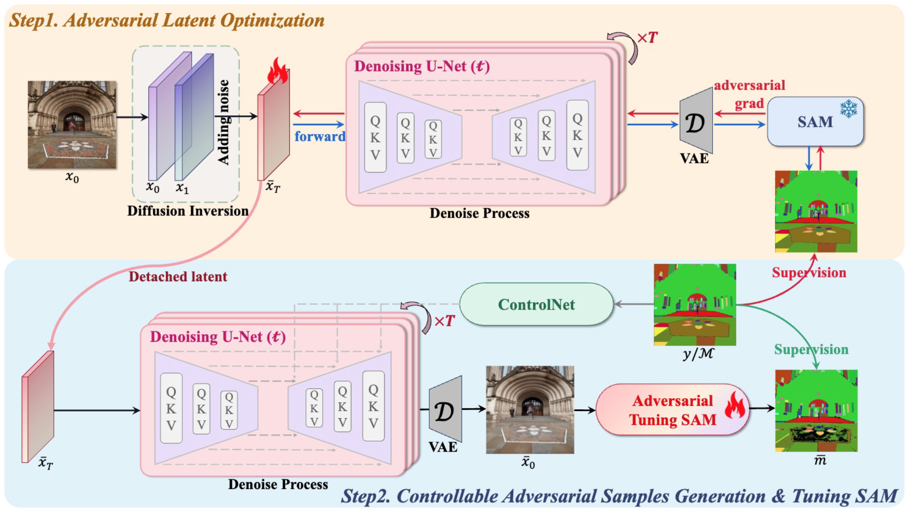
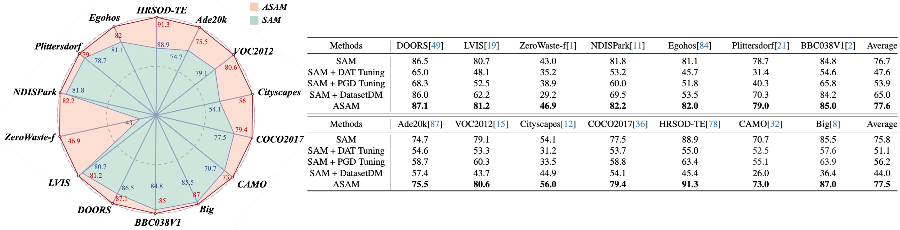
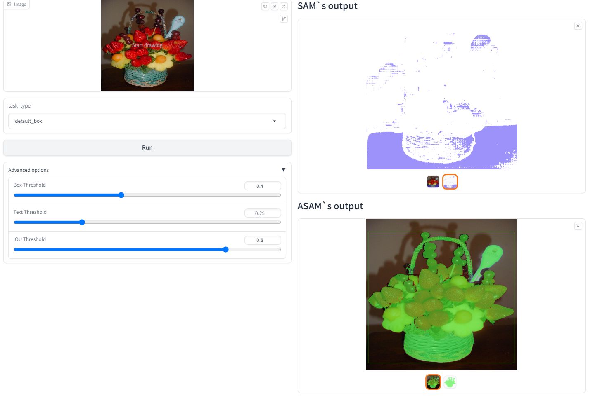

## ASAM: Boosting Segment Anything Model with Adversarial Tuning, CVPR2024

<font size=7><div align='center'>ASAM: Boosting Segment Anything Model with Adversarial Tuning</div></font>
<p align="center">
  <a href='https://github.com/luckybird1994/ASAM'></a>
  <a href='http://arxiv.org/abs/2306.15195'></a>
  <a href='https://huggingface.co/spaces/xhk/ASAM'></a>
  <a href='https://huggingface.co/xhk/ASAM'></a>
  <a href='https://huggingface.co/datasets/xhk/ASAM-Datasets'></a>
</p>

<div align=center></div>

## Abstract

In the evolving landscape of computer vision, foundation models have emerged as pivotal tools, exhibiting exceptional adaptability to a myriad of tasks. Among these, the Segment Anything Model (SAM) by Meta AI has distinguished itself in image segmentation. However, SAM, like its counterparts, encounters limitations in specific niche applications, prompting a quest for enhancement strategies that do not compromise its inherent capabilities. This paper introduces ASAM, a novel methodology that amplifies SAM's performance through adversarial tuning. We harness the potential of natural adversarial examples, inspired by their successful implementation in natural language processing (NLP). By utilizing a stable diffusion model, we augment a subset (1\%) of the SA-1B dataset, generating adversarial instances that are more representative of natural variations rather than conventional imperceptible perturbations. Our approach maintains the photorealism of adversarial examples and ensures alignment with original mask annotations, thereby preserving the integrity of the segmentation task. The fine-tuned ASAM demonstrates significant improvements across a diverse range of segmentation tasks without necessitating additional data or architectural modifications. The results of our extensive evaluations confirm that ASAM establishes new benchmarks in segmentation tasks, thereby contributing to the advancement of foundational models in computer vision.

## Performance
<div align=center></div>

## News
- [x] [2024.02.27] Paper is accepted by CVPR2024 and GitHub repo is created.
- [x] [2024.03.10] We release the training code, pre-trained models, datasets and online demo.

## :fire: Highlight

**ASAM** is the enhanced version of SAM, improving the generalizability and keeping the original model structure. Without any pain, ASAM can replace the SAM anywhere for better performance. We release [ASAM checkpoint](https://huggingface.co/xhk/ASAM/tree/main) and [continuously updated checkpoints](https://huggingface.co/xhk/ASAM/tree/main) on huggingface. Just enjoy!

## Installation

```bash
conda env create -f environment.yml
```


## Training
[Preparing datasets](docs/data.md) and [training an mask-guided ControlNet](docs/controlnet.md) in advance, then you can start to **project images to diffusion latents** using this command:
```bash
python null_text_inversion.py \
    --save_root=output/sa_000000-Inversion \
    --data_root=SAM-1B/sa_000000 \
    --control_mask_dir=SAM-1B/sa_000000 \
    --caption_path=SAM-1B/sa_000000-blip2-caption.json \
    --controlnet_path=ckpt/control_v11p_sd15_mask_inv.pth \
    --guidence_scale=7.5 \
    --steps=10 \
    --ddim_steps=50 \
    --start=0 \
    --end=11187
```
or directly `bash scripts/inversion.sh`, where `--controlnet_path` is the checkpoint of pretrained ControlNet and `--guidence_scale --steps --ddim_steps` are the diffusion-style arguments.

**Tips:** If you meet Connnection Error when downloading Stable Diffusion Checkpoint from Huggingface, you can consider `export HF_ENDPOINT=https://hf-mirror.com.`

Next, download pretrained [SAM(vit-base) checkpoint](https://github.com/facebookresearch/segment-anything?tab=readme-ov-file), then optimize the diffusion latents to generate adversarial exampls using this command:
```bash
python grad_null_text_inversion_edit.py \
    --save_root=output/sa_000000-Grad \
    --data_root=SAM-1B/sa_000000 \
    --control_mask_dir=SAM-1B/sa_000000 \
    --caption_path=SAM-1B/sa_000000-blip2-caption.json \
    --inversion_dir=output/sa_000000-Inversion/embeddings \
    --controlnet_path=ckpt/control_v11p_sd15_mask_adv.pth \
    --eps=0.2 --steps=10 --alpha=0.02 \
    --mu=0.5 --beta=1.0 --norm=2 --gamma=100 --kappa=100 \
    --sam_batch=140 \
    --start=0 --end=11186 \
    --model_pth=ckpt/sam_vit_b_01ec64.pth
```
or directly `bash scripts/grad.sh`, where `--mu=0.5  --beta --norm=2 --gamma --kappa` are the adversarial-style arguments.

At this point, we have got adversarial examples. We use them to tuning SAM by this command:
```bash
cd sam_continue_learning
python -m torch.distributed.run --nproc_per_node=8 --master_port=30011  main.py \
    --model-type vit_b \
    --output_prefix asam_vit-b_tuning \
    --find_unused_params \
    --train-datasets=dataset_sa000000_adv \
    --valid-datasets=dataset_hrsod_val \
    --slow_start 
```
or `bash sam_continue_leanring/scripts/tuning.sh`. ASAM checkpoint will be saved at `sam_continue_leanring/workdirs/asam_vit-b_tuning` directory.

## Inference
After finishing training process and preparing the [test data](docs/data.md), we can inference ASAM using this command:
```bash
cd sam_continue_learning
python -m torch.distributed.run --nproc_per_node=1 --master_port=30002  main.py \
    --model-type vit_b \
    --eval \
    --prompt_type box \
    --train-datasets dataset_sa000000_adv \
    --valid-datasets dataset_coco2017_val \
    --restore-model work_dirs/asam_vit-b_tuning/asam_decoder_epoch_19.pth \
```
or directly `bash scripts/sam_continue_leanring/test.sh`, where `--restore-model` is the ASAM decoder checkpoint path and `--valid-datasets` is the test datasets.

## Demo
We provide the [online demo](https://huggingface.co/spaces/xhk/ASAM) on huggingface, for example:
<div align=center></div>

## Cite
```bibtex
@article{tang2023can,
  title={Can sam segment anything? when sam meets camouflaged object detection},
  author={Tang, Lv and Xiao, Haoke and Li, Bo},
  journal={arXiv preprint arXiv:2304.04709},
  year={2023}
}
```

## Acknowledgement
This repo benefits from [SAM](https://github.com/facebookresearch/segment-anything) and [ControlNet](https://github.com/lllyasviel/ControlNet).  Our heartfelt gratitude goes to the developers of these resources!

## Contact   
Feel free to leave issues here or send our e-mails (libra@vivo.com, hk.xiao.me@gmail.com, luckybird1994@gmail.com).
### 
