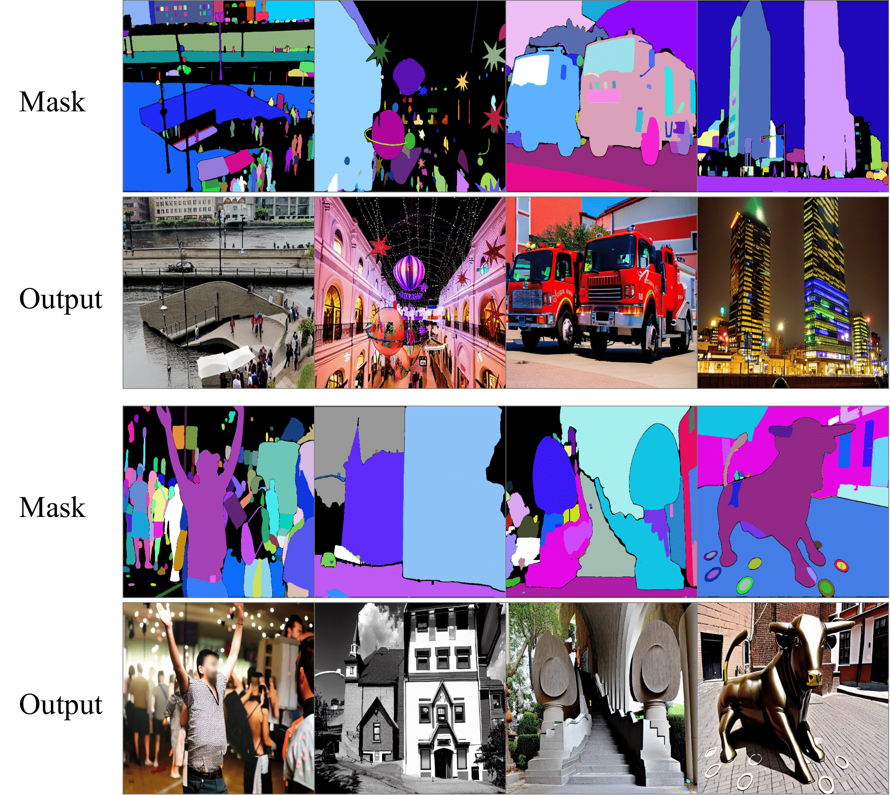

We use [sa_000000](https://ai.meta.com/datasets/segment-anything-downloads/) to train [ControlNet](ControlNet/README.md) and image captions are generated by [Blip2_t5](https://github.com/salesforce/LAVIS/tree/main/projects/blip2). More details abount ControlNet training can be found [here](ControlNet/docs/train.md). We also provide the pretrained [ControlNet chekpoints](https://huggingface.co/xhk/ASAM/tree/main) on huggingface.

There are examples of our mask-guided Controlnet:

